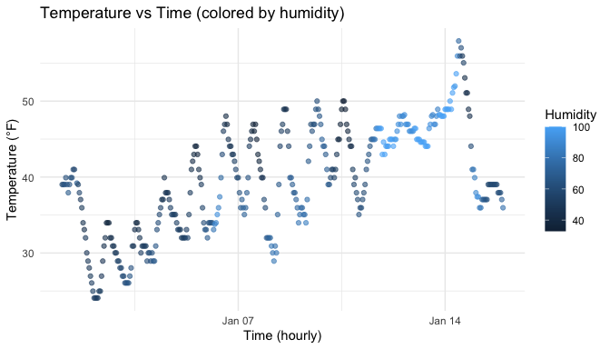

p8105_hw1_bl3175
================

``` r
data("early_january_weather")
glimpse(early_january_weather)
```

    ## Rows: 358
    ## Columns: 15
    ## $ origin     <chr> "EWR", "EWR", "EWR", "EWR", "EWR", "EWR", "EWR", "EWR", "EW…
    ## $ year       <int> 2013, 2013, 2013, 2013, 2013, 2013, 2013, 2013, 2013, 2013,…
    ## $ month      <int> 1, 1, 1, 1, 1, 1, 1, 1, 1, 1, 1, 1, 1, 1, 1, 1, 1, 1, 1, 1,…
    ## $ day        <int> 1, 1, 1, 1, 1, 1, 1, 1, 1, 1, 1, 1, 1, 1, 1, 1, 1, 1, 1, 1,…
    ## $ hour       <int> 1, 2, 3, 4, 5, 6, 7, 8, 9, 10, 11, 13, 14, 15, 16, 17, 18, …
    ## $ temp       <dbl> 39.02, 39.02, 39.02, 39.92, 39.02, 37.94, 39.02, 39.92, 39.…
    ## $ dewp       <dbl> 26.06, 26.96, 28.04, 28.04, 28.04, 28.04, 28.04, 28.04, 28.…
    ## $ humid      <dbl> 59.37, 61.63, 64.43, 62.21, 64.43, 67.21, 64.43, 62.21, 62.…
    ## $ wind_dir   <dbl> 270, 250, 240, 250, 260, 240, 240, 250, 260, 260, 260, 330,…
    ## $ wind_speed <dbl> 10.35702, 8.05546, 11.50780, 12.65858, 12.65858, 11.50780, …
    ## $ wind_gust  <dbl> NA, NA, NA, NA, NA, NA, NA, NA, NA, NA, NA, NA, NA, NA, 20.…
    ## $ precip     <dbl> 0, 0, 0, 0, 0, 0, 0, 0, 0, 0, 0, 0, 0, 0, 0, 0, 0, 0, 0, 0,…
    ## $ pressure   <dbl> 1012.0, 1012.3, 1012.5, 1012.2, 1011.9, 1012.4, 1012.2, 101…
    ## $ visib      <dbl> 10, 10, 10, 10, 10, 10, 10, 10, 10, 10, 10, 10, 10, 10, 10,…
    ## $ time_hour  <dttm> 2013-01-01 01:00:00, 2013-01-01 02:00:00, 2013-01-01 03:00…

## Problem 1

**Dataset description (with inline R)**  
This dataset has **358** rows and **15** columns.  
Variable names include: origin, year, month, day, hour, temp, dewp,
humid, wind_dir, wind_speed, wind_gust, precip, pressure, visib,
time_hour.  
The mean temperature is **39.6** °F.  
The `time_hour` variable is of class **POSIXct** (hourly timestamps).  
Humidity (`humid`) ranges from **32.86** to **100**.

## Scatterplot of temp vs time_hour (colored by humidity)

``` r
# Build the scatterplot and store it in object `p`
p <- ggplot(early_january_weather, aes(x = time_hour, y = temp, color = humid)) +
  geom_point(alpha = 0.6) +
  labs(
    title = "Temperature vs Time (colored by humidity)",
    x = "Time (hourly)",
    y = "Temperature (°F)",
    color = "Humidity"
  ) +
  theme_minimal()

# Print the plot
p
```

<!-- -->

## Export the plot to the project directory

``` r
# Create a folder to keep figures

if (!dir.exists("figs")) dir.create("figs")

# Save the plot 
ggsave("figs/temp_vs_time.png", plot = p, width = 7, height = 4, dpi = 300)
```
